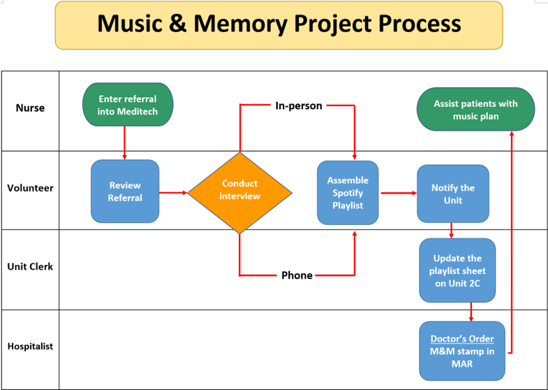

# Introduction to Music & Memory Initiative
Many patients, especially those experiencing dementia or delirium, often face emotional difficulties within their hospital journey. The Music and Memory initiative aims to support the emotional needs of these patients by providing personalized music plan. Familiar music can be grounding, reassuring, and comforting in an unfamiliar medical environment. This initiative offers the added benefit of promoting joy among patients, families, and healthcare workers alike.

## Overview
{ loading=lazy }