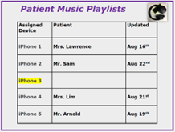
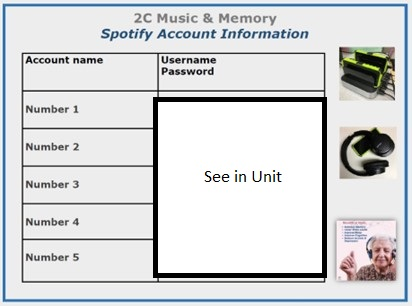
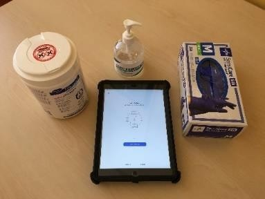

# Creating Spotify Playlists on the Mobile Device
## Steps to creating a playlist
Create the music playlist on Spotify at the bedside with the patient. This will allow the volunteer to assess the patient’s reactions to each song.

1.	Assign a device to the patient and set it up
    
    Review the Music & Memory Playlist poster behind the nursing station and identify a specific Spotify device/account for the patient. Each device is logged into a specific Spotify Account (Ex: iPhone / Tablet #3 = Spotify Account #3). 
    <figure markdown>
    { loading=lazy width="200" }
    </figure>      
    Account Usernames and Passwords are located next to the M&M Playlist Poster.
    <figure markdown>
    { loading=lazy width="200" }   
    </figure>     
    Set Up Wifi by selecting Wi-Fi “Fraser Health Guest” and accepting the policy

    Set-Up the headset by linking the iPhone to its corresponding cordless Headset (iPhone/Tablet #1 = Headset #1).

2.	Open the Spotify App and set it up
    Check that the device is logged into the proper Spotify Account (iPhone #2 = Account #2)
    Note: If the device you need is not available, Log into another device with the patient’s username and password, create the playlist, then log out and back into the original account

3.	Create Playlist:
    
    In Spotify, select “Create Playlist”, then Click on the Playlist Title. Title the playlist with the patient’s last name and bed #.
    
4.  Add songs to the playlist

    Use the search bar to locate songs and click "add" to add songs to the playlist

5.	As able, play each song for the patient and discard unwanted ones.

    Ensure to test the volume before trialing the music with the patient

6.	When finished thank the patient and download the new playlist to the device

7. Clean & charge Equipment

    Sanitize Headset and iPhone / Tablet with hospital-grade cleaners using gloves. Plug headset and iPhone into the charging station
    <figure markdown>
    { loading=lazy width="200" }
    </figure>  

If unable to test each song with the patient, create the playlist after the interview.

## Next Step
Notify the Unit Clerk if avaliable at the front desk, and the team of the new playlist via email. See [notifying.](notify.md)