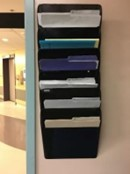
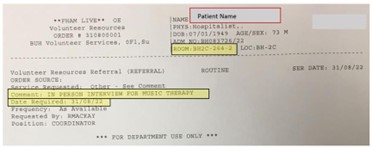
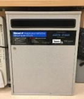

# Referral

## Refer a Patient

## Locate the Referral
•	Volunteer Resources receives an electronic referral from Unit 2C at the volunteer administration printer
•	Referrals can be found in room 016 (next to the manager’s office)
•	Check the printer or the Music & Memory Folder mounted next to the door

<figure markdown="1">
    { width="180" }
    <figcaption>Figure 1: Music & Memory Folder</figcaption>
</figure>

## Assess the Referral

•	The referral should include the patient’s name and room number
•	The referral will indicate whether the interview is in-person on Unit 2C or by phone with family
•	Phone interviews will include the family members name and contact number

<figure markdown="1">
    { width="300" }
    <figcaption>Figure 2: Referral Form Sample</figcaption>
</figure>

## Steps to Preserve Patient Confidentiality

•	When bringing the paper referral to the unit, fold it to protect patient information and discard in the Fraser Health SHRED-IT box
•	When conducting telephone interviews discard the referral paper in the Fraser Health SHRED-IT box immediately after the call

<figure markdown="1">
    { width="180" }
    <figcaption>Figure 3: SHRED-IT Box</figcaption>
</figure>